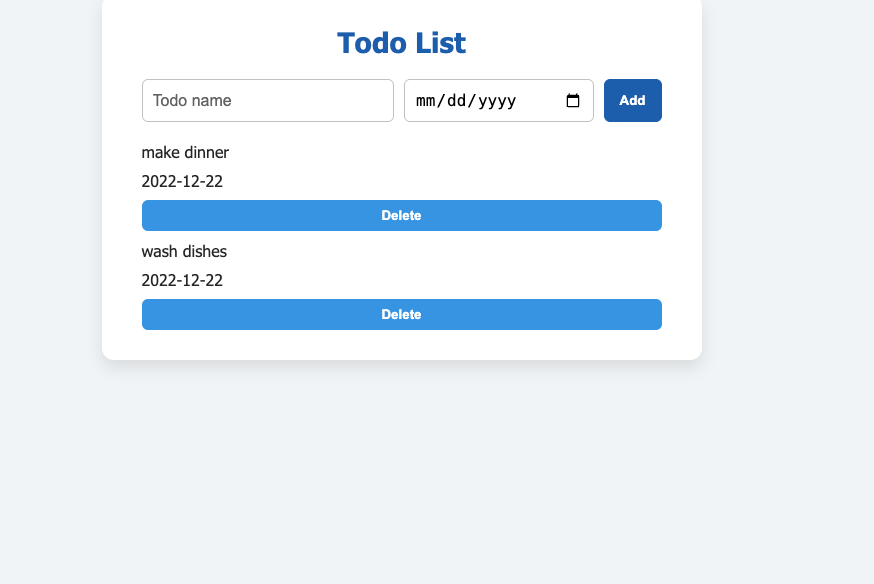

# To-DO-HTML-CSS-JS

This is a simple, clean, and interactive **Todo List** web application built with **HTML**, **CSS**, and **JavaScript**. It allows users to add, mark as complete, and delete tasks with a modern animated UI.

---

## Features

- Add new tasks with a due date
- Delete tasks with smooth fade-out animation
- Mark tasks as completed (strikethrough effect)
- Clean and responsive UI
- Built with vanilla JS (no frameworks)

---

## Live Demo

[Click here to view the live app](https://guadeloupe33.github.io/To-DO-HTML-CSS-JS/)  

---

## Screenshot



---

## Project Structure
index.html # Main HTML structure ├── style.css # Styling and animations ├── script.js # Interactive functionality └── README.md # Project info

---

## How to Use

1. Clone the repo:
   ```bash
   git clone https://github.com/Guadeloupe33/To-DO-HTML-CSS-JS.git
